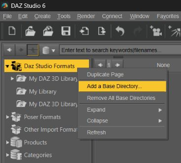

# Character Transfer for Daz Studio 6

> Free tool to transfer Genesis 1-9 head & body morphs & characters to Genesis 8-9

## Table of Contents

- [Features](#features)
- [Supported source & target figures](#supported-source-target-figures)
- [Installation](#installation)
    - [1) First install](#1-first-install)
	- [2) Updating existing install](#2-updating-existing-install)
- [User Manual](#user-manual)
- [Getting in touch](#getting-in-touch)
- [License restrictions](#license-restrictions)

## Features

> Transfer morphs & character presets from source (donor) to target (receiver) using precomputed barycentric coordinates (no Transfer Utility, no Morph Loader, no Wavefront obj import/export)

| Feature | State | Comment |
| :-: | :-: | :-: |
| **Batch processing** | ✅ |  |
| **Ability to select morphs to transfer** | ✅ |  |
| **Ability to select controllers to transfer** | ✅ |  |
| **Ability to select characters to transfer** | ☠️ | All characters are processed based on available transferred morphs & controllers |
| **Morphs transfer** | ✅ | Only character morphs (head & body) |
| **Navel & nipples morphs transfer** | ☠️ | For transfers between G8 & G9 |
| **Non-split character morphs transfer** | ☠️ | You can use Character Splitter to split the source morph or wait for this feature integrated here |
| **Partial morphs transfer** | ☠️ | Eg. nose, ears, eyes... |
| **Parametric Morphs** | ☠️ | Requires transfering non-character morphs (eg. nose, ears, eyes...) used by the source figure |
| **Support all G9 eyebrows styles** | ☠️ | Only card style |
| **Controllers transfer** | ✅ |  |
| **Automatic Eyes scaling & positioning** | ✅ |  |
| **Automatic Mouth scaling & positioning** | ✅ | Todo : bypass G9 translation limits & handle protrusion on extreme morphs |
| **Automatic Scene setup** | ✅ | Fullt automated (no user action required) |
| **Character Presets transfer** | ✅ | Optional |
| **Presentation & settings transfer** | ✅ |  |
| **Preserve original asset info** | ✅ |  |
| **Copy cards & icons** | ✅ | Optional |
| **Shaping Presets transfer** | ☠️ |  |
| **Material Presets transfer** | ☠️ |  |
| **Skeleton pruning** | ✅ | No head bones for body morphs & no body bones for head morphs |
| **Sparse deltas** | ✅ | No head deltas for body morphs & no body deltas for head morphs |
| **Post-load Settings** | ✅ | For G8 & G9 character presets (basic support, tied to material presets) |
| **No attachment morphs for Body morphs** | ✅ |  |
| **Unload deltas after use** | ✅ |  |

## Supported source & target figures

| Source / Target | G8F | G8F.1 | G8M | G8M.1 | G9 |
|:-:|:-:|:-:|:-:|:-:|:-:|
|   **G1**  | ✅ | ✅ | ✅ | ✅ | ✅ |
|  **G2F**  | ✅ | ✅ | ✅ | ✅ | ✅ |
|  **G2M**  | ✅ | ✅ | ✅ | ✅ | ✅ |
|  **G3F**  | ✅ | ✅ | ✅ | ✅ | ✅ |
|  **G3M**  | ✅ | ✅ | ✅ | ✅ | ✅ |
|  **G8F**  | ❌ | ✅ | ✅ | ✅ | ✅ |
| **G8F.1** | ✅ | ❌ | ✅ | ✅ | ✅ |
|  **G8M**  | ✅ | ✅ | ❌ | ✅ | ✅ |
| **G8M.1** | ✅ | ✅ | ✅ | ❌ | ✅ |
|   **G9**  | ✅ | ✅ | ✅ | ✅ | ❌ |

## Installation

### 1) First install

<u>Steps</u> :
1) [Download](https://github.com/Mike3D/Character-Transfer-for-DAZ-Studio/archive/refs/heads/main.zip) latest version of this repository
2) Extract the zip file anywhere you want (you can rename the directory as you please)
3) Create a separate content library from the extracted folder

There are 3 main reasons as to why we recommand to create a separate content library :
- you can use this library as a sandbox. If something goes awry, you can easily find the culprit & remove it, or remove the whole directory if necessary
- it allows to easily identify & filter out transferred morphs & characters from the list of available morphs. Indeed, once morphs, controllers & characters have been transferred to another figure, they become available to transfer to another figure. For example, if you transfer some morphs from G1 to G9, then when you want to transfer your G9 morphs to G8, the G1 morphs will show up and we need to exclude them, as the direct transfer from G1 to G8 will yield better results
- it greatly simplifies the update to keep up to date with the Github repository

<u>Creating a separate content library is very simple</u> :
- In the “Content Library pane”, right click on “Daz Studio Formats” & select “Add a Base Directory…”
- Then browse to where you extracted the zip file downloaded from Github

### 2) Updating existing install

<u>Steps</u> :
1) [Download](https://github.com/Mike3D/Character-Transfer-for-DAZ-Studio/archive/refs/heads/main.zip) latest version of this repository
2) Extract the zip file to your previous install location (this will merge new content to old)

## User Manual

## Getting in touch
If you want to get in touch, you can find us on the Daz 3D Forums :

https://www.daz3d.com/forums/discussion/617476/character-transfer

## License restrictions

The GUI part is adapted from [GenNext](https://github.com/ArchitectMCP/GenNext), which is licensed by Architect under Creative Commons Attribution 3.0 Unported (CC BY 3.0).

Portions of related code that are similar theoretically fall under this license.